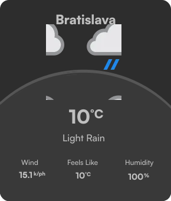
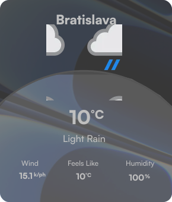

<h1 align="center">WinDock</h1>

Upgrade your Windows experience with WinDock – the ultimate widget solution! Sure, Rainmeter exists, but why hassle with complexity when you can glide through with WinDock's user-friendly interface? We're not just about widgets; we're about simplicity, modernity, and packing in more features than ever before!

Featyres like Marketplace in our settings app – your one-stop shop for all widgets and themes for WinDock. Need to spice up your desktop? With just one click, install Spicetify. And that's just the beginning!

Stay tuned as we roll out even more exciting features that'll revolutionize your Windows experience. WinDock – because why settle for anything less than effortless excellence?

 

 
> [!WARNING]
> Please keep in mind that WinDock is at a very early stage of development

# TODO
Widgets: 
 - Clock Widget
 - Calendar widget - google
 - News widget
 - Photo Widget
 - Mail widget
 - Battery widget - battery of bluetooth connected devices
 - Bluetooth Widget - connected devices
 - Google widget
 - Maps widget
 - RAM/CPU/GPU Widget
 - Screentime Widget

- Website

Themes: 
 - Dark theme
 - White theme
 - *more...*

# Done
Widgets: 
 - Spotify widget
 - Weather widget

Themes:
 - Transparent theme
 - Default theme

# Preview

# Ideas? 

Any ideas of new feature? Join our Discord: <...>
