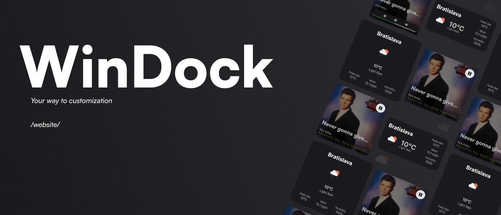

<h1 align="center">WinDock</h1>

Upgrade your Windows experience with WinDock – the ultimate widget solution! Sure, Rainmeter exists, but why hassle with complexity when you can glide through with WinDock's user-friendly interface? We're not just about widgets; we're about simplicity, modernity, and packing in more features than ever before!

Features like Marketplace in our settings app – your one-stop shop for all widgets and themes for WinDock. Need to spice up your desktop? With just one click, install [Spicetify](https://spicetify.app/). And that's just the beginning! Comming...

Stay tuned as we roll out even more exciting features that'll revolutionize your Windows experience. WinDock – because why settle for anything less than effortless excellence?

 

 
> [!WARNING]
> Please keep in mind that WinDock is at a very early stage of development

# TODO
Widgets: 
 - Clock Widget
 - Calendar widget - google
 - News widget
 - Photo Widget
 - Mail widget
 - Battery widget - battery of bluetooth connected devices
 - Bluetooth Widget - connected devices
 - Google widget
 - Maps widget
 - RAM/CPU/GPU Widget
 - Screentime Widget

- Website

Themes: 
 - Dark theme
 - White theme
 - *more...*

# Done
Widgets: 
 - Spotify widget
 - Weather widget

Themes:
 - Transparent theme
 - Default theme

# Preview

 Soon...

# Contributors 

Thank you for banner and logo [Charlie](https://github.com/0Charliecat) 

- [Butwm](https://github.com/Butwm) 
- [vilemhaupt](https://github.com/vilemhaupt) 

# Ideas? 

Any ideas of new feature? Join our Discord: <...>
